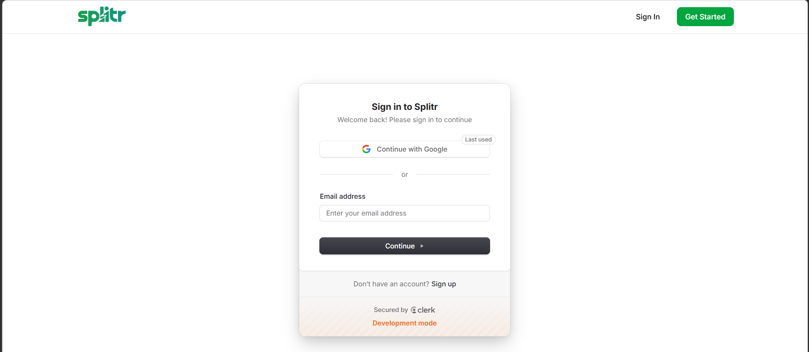
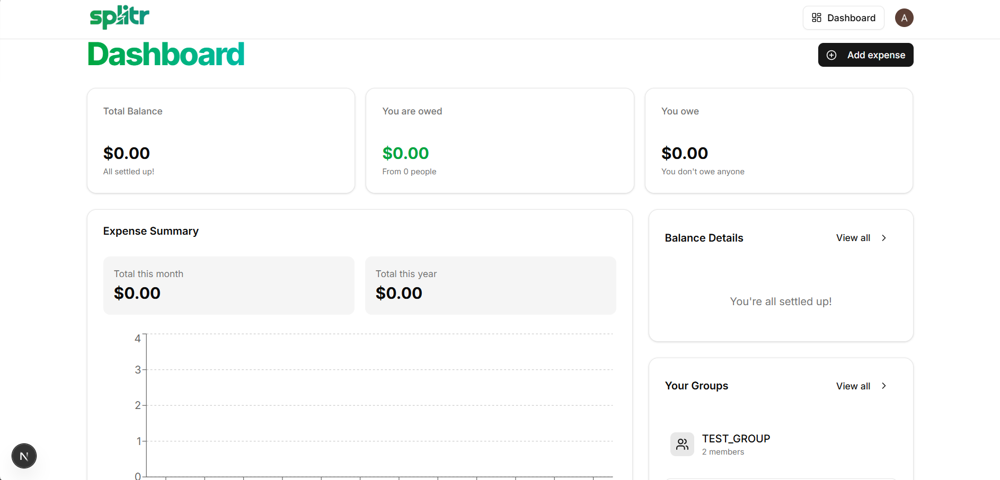
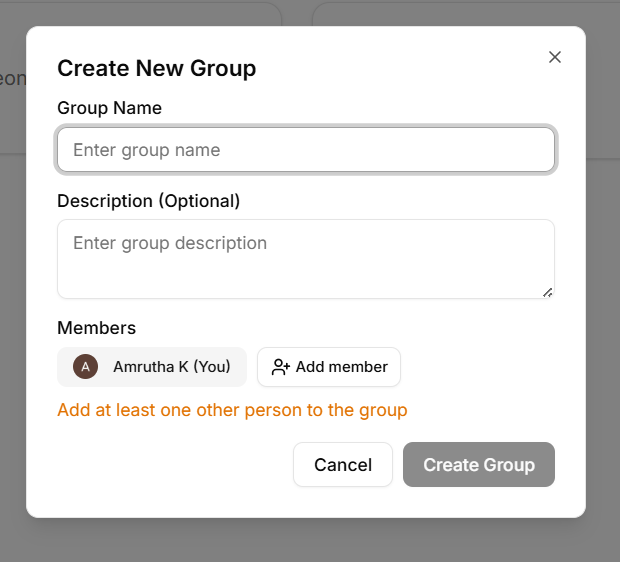
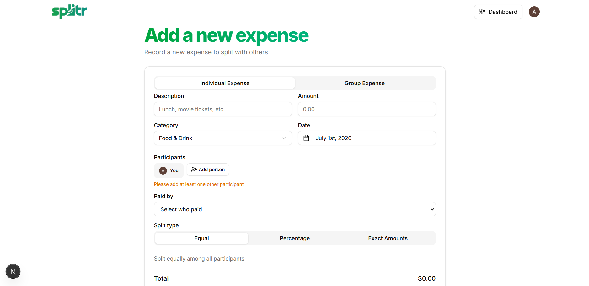
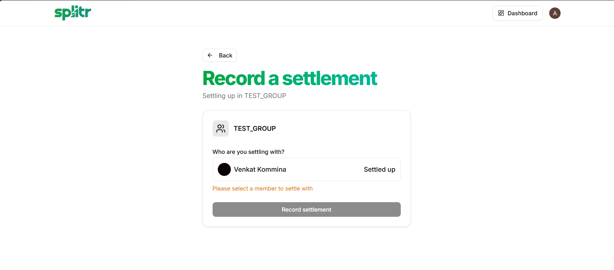

# 💰 AI Splitwise Clone

An AI-powered expense sharing and group expense management web application inspired by Splitwise. The platform enables users to create groups, add expenses, calculate balances automatically, settle payments, and leverage AI to simplify expense management. It provides secure authentication, real-time synchronization, and an intuitive interface for managing shared finances.

---

## 📖 Description

AI Splitwise Clone is a full-stack web application built using **Next.js** and **Convex** that helps users manage shared expenses with friends, roommates, colleagues, or family members.

The application supports:

- Secure Google Authentication
- Group creation and member management
- Expense tracking and splitting
- Automatic balance calculation
- Settlement history
- AI-assisted expense management
- Real-time database synchronization
- Responsive user interface

---

## ✨ Features

- 🔐 Secure authentication using Clerk
- 👥 Create and manage expense groups
- ➕ Add members to groups
- 💸 Add and split expenses
- 📊 Automatic balance calculation
- 🤝 Record settlements between members
- 🔍 Search users by name or email
- 🤖 AI-powered expense assistance using Google Gemini
- 📧 Email notifications using Resend
- ⚡ Real-time backend powered by Convex
- 📱 Responsive design

---

## 🛠️ Tech Stack

### Frontend

- Next.js 15
- React 19
- TypeScript / JavaScript
- Tailwind CSS
- Shadcn UI

### Backend

- Convex
- Convex Database
- Convex Functions

### Authentication

- Clerk Authentication

### AI

- Google Gemini API

### Email Service

- Resend

### Background Jobs

- Inngest

## ⚙️ Prerequisites

Before running the project, ensure you have:

- Node.js (v20 or later)
- npm
- Convex CLI
- Clerk Account
- Google AI Studio API Key
- Resend Account

---

## 🔑 Environment Variables

Create a `.env.local` file in the project root.

```env
CONVEX_DEPLOYMENT=

NEXT_PUBLIC_CONVEX_URL=

NEXT_PUBLIC_CLERK_PUBLISHABLE_KEY=
CLERK_SECRET_KEY=

CLERK_JWT_ISSUER_DOMAIN=

NEXT_PUBLIC_CLERK_SIGN_IN_URL=/sign-in
NEXT_PUBLIC_CLERK_SIGN_UP_URL=/sign-up

GEMINI_API_KEY=

RESEND_API_KEY=
```

---

## 🚀 Installation

Clone the repository

```bash
git clone https://github.com/amrutha-kommina/splitr.git
```

Navigate into the project

```bash
cd splitr
```

Install dependencies

```bash
npm install
```

---

## ▶️ Running Locally

### Start Convex

```bash
npx convex dev
```

Open another terminal and run

```bash
npm run dev
```

Visit

```
http://localhost:3000
```

---

## 🧠 Backend Overview

The backend is implemented using **Convex Functions**.

| File | Purpose |
|------|----------|
| users.js | User authentication, user storage, search users |
| groups.js | Group creation, member management, balances |
| expenses.js | Expense CRUD operations |
| settlements.js | Settlement management |
| dashboard.js | Dashboard statistics |
| contacts.js | Contact management |
| email.js | Email notifications |
| inngest.js | Background jobs |
| schema.js | Database schema |
| auth.config.js | Clerk authentication provider |

---

## 📊 Database

The application uses Convex Database with collections including:

- Users
- Groups
- Expenses
- Settlements

Search indexes are used for:

- User names
- User emails

---

## 🤖 AI Integration

Google Gemini API is used to provide AI-powered assistance for expense management and intelligent user interactions.

---

## 📧 Email Notifications

Resend is integrated to send email notifications and invitations.

---

## 🔒 Authentication

Authentication is handled using Clerk with:

- Google Sign-In
- JWT Authentication
- Secure Session Management

---

## 🌐 Deployment

This project can be deployed using:

- Vercel (Recommended)
- Convex
- Clerk
- Resend
- Google Gemini API

Deployment Steps:

1. Push the project to GitHub.
2. Import the repository into Vercel.
3. Add all environment variables.
4. Connect the Convex deployment.
5. Deploy.

---

## 📸 Screenshots

### 🔐 Sign In Page



---

### 📊 Dashboard



---

### 👥 Create Group



---

### 💸 Expense Details



---

### 🤝 Settlement Details



---

## 📈 Future Enhancements

- Multi-currency support
- OCR receipt scanning
- Recurring expenses
- Mobile application
- Export reports (PDF/Excel)
- Dark mode improvements

---

## 👨‍💻 Author

Amrutha Kommina

GitHub: https://github.com/amrutha-kommina

LinkedIn: https://linkedin.com/in/amrutha-kommina